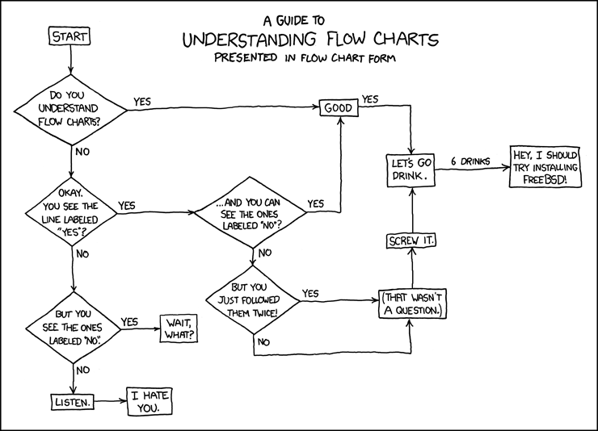

<figure>
    
        
    
    <figcaption>
        
    </figcaption>
</figure>

- [Flowcharts](#flowcharts)

# Flowcharts

TODO:

- use figures from textbook; available from publisher site
- be sure to note things that the book does that I don't
  - input/output are different
  - we don't use any special symbols for comments
  - We don't use module calls, but it's good to be aware of them
