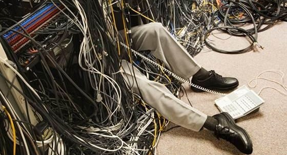

- [Announcements / Agenda](#announcements--agenda)
- [Module 01](#module-01)
  - [Day 1](#day-1)
  - [Day 2](#day-2)
  - [Day 3](#day-3)
- [Module 02](#module-02)
  - [Day 4](#day-4)
- [Reference](#reference)

# Announcements / Agenda

<figure>
    
        
    
</figure>

- Sign up for proctored exams if you're a remote student.
- Lecture
- Intro Truth Tables Assignment

# Module 01

## Day 1

[Computer Orientation](../common/computer_orientation.html?course=SDEV120)

[Propositional Logic - Intro and Connectives](propositional_logic_intro_connectives.md)

## Day 2

[Propositional Logic - Order of Operations](propositional_logic_order_of_operations.md)

[Solving Problems with Truth Tables](solving_problems_with_truth_tables.md)

[Solving Problems with Logical Arguments](solving_problems_with_logical_arguments.md)

## Day 3

[Logic Gates](logic_gates.md)

[Set Theory](set_theory.md)

# Module 02

## Day 4

Algorithms and Structured Programming

Pseudocode

Flowcharts

# Reference

[Unix Basic Commands](../common/unix_basic_commands.html?course=SDEV120)
