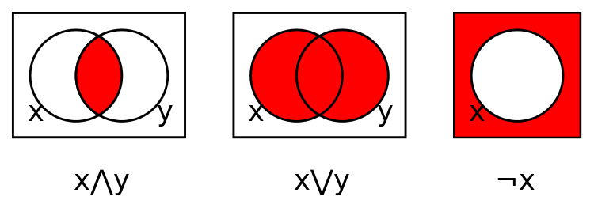
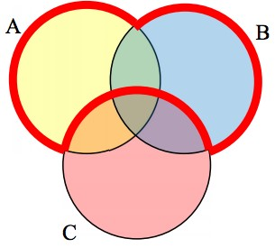

> The Tao produced One; One produced Two; Two produced Three; Three produced All things. \
-- Lao-tzu

- [Announcements](#announcements)
- [Agenda](#agenda)

## Announcements

- Ch6 reading on arrays added to IvyLearn

## Agenda

- Finish M05
- Review M06 assignments
- Lecture M06

<!-- SDLC?; UML; state diagrams; set theory and related logic -->

# UML

<!-- ref: https://docs.google.com/document/d/1Ok6_Q5JWYdK6HiAb7YKZR1Aw13tNrHm8aajtnA-ZUFc/edit -->

## What is it?

**UML** = Unified Modeling Language

- Standardized way to model software. 
- Visual language that allows us to communicate the design of a system.
- Primary authors are Grady Booch, James Rumbaugh, and Ivar Jacobson.
- Solved problem of competing / differing documentation styles.
    - You can show UML to someone anywhere in the world and they will understand it.

These diagrams capture information about various contexts.

- Roles of people building / maintaining / using the software.
- Hardware involved.
- Functionality of the system, in various scopes and levels of detail.

#### What is it not
- UML is _not_ a programming language. It's a visual description language.

## What is it used for?

- Planning new functionality for software.
- Reference when modifying existing functionality.
- Communicating with stakeholders (documentation).
- Training new team members.

## Classifications of UML Diagrams

<figure>
    
        
    
    <figcaption>
        
    </figcaption>
</figure>

### Structural Diagrams

Show static relationships between system components; anatomy of a system.

Types include:
- Class Diagram
- Object Diagram
- Component Diagram
- Deployment Diagram
- Package Diagram
- Composite Structure Diagram

### Behavioral Diagrams

Show dynamic interactions between system components; behavior of a system.

Types include:
- Use Case Diagram
- Activity Diagram
- State Machine Diagram
- Sequence Diagram
- Communication Diagram
- Timing Diagram

## Types of UML Diagrams

From [An introduction to the Unified Modeling Language - IBM Developer](https://developer.ibm.com/articles/an-introduction-to-uml/):

> "The most useful, standard UML diagrams are: use-case diagram, class diagram, sequence diagram, statechart diagram, activity diagram, component diagram, and deployment diagram."

### Use Case Diagram

<figure>
    
        
    
    <figcaption>
        <a href="https://drawio-app.com/wp-content/uploads/2018/10/UseCase-HabitTrackingApp.png">
            Use case diagram for habit tracking app.
        </a>
    </figcaption>
</figure>

#### Description

- Represent functionality, actors, and how these relate to each other in the context of a system.
- "High level" scope; not much detail.
- Useful for planning new functionality.
- Useful for communicating with stakeholders.

#### Key components

- Actors
- Use cases
- Relationships between actors and use cases
    - *Optionally, relationships between use cases (includes / extends)
- System boundaries

### Class Diagram

<figure>
    
        
    
    <figcaption>
        <a href="https://drawio-app.com/wp-content/uploads/2018/01/Class-Diagram-Habit-Tracker-app.png">
            Class diagram for a habit tracking app.
        </a>
    </figcaption>
</figure>

#### Description

- Shows how entities (classes) in a system relate to each other.
- Classes contain self-describing attributes and methods.
- Connectors between classes show **cardinality**; how many of one class can be related to another class.
    - https://www.uml-diagrams.org/multiplicity.html
    - Also... Crow's feet notation.

| Multiplicity | Option | Cardinality                             |
| :----------- | :----- | :-------------------------------------- |
| 0..0         | 0      | Collection must be empty                |
| 0..1         |        | No instances or one instance            |
| 1..1         | 1      | Exactly one instance                    |
| 0..*         | *      | Zero or more instances                  |
| 1..*         |        | At least one instance                   |
| 5..5         | 5      | Exactly 5 instances                     |
| m..n         |        | At least m but no more than n instances |

- Entities can be concrete or abstract. From above:
  - Concrete examples:
    - Person
    - ??? (what else?)
  - Abstract examples:
    - Comment
    - ??? (what else?)

#### Key components

- Classes
- Attributes
- Methods
- Relationships between classes (cardinality)
  
walkthrough: For dog walking service, how would I show…
- Dog walker and client (person)?
- Dogs that he/she is scheduled to walk?
- Relationships?
- Any other classes needed?

### Sequence Diagram

<figure>
    
        
    
    <figcaption>
        <a href="https://drawio-app.com/wp-content/uploads/2018/02/drawio-sequence-checkin.png">
            Sequence diagram for a habit tracking app.
        </a>
    </figcaption>
</figure>

#### Description

- Shows interactions between objects in a system...
   - over time
   - for a specific use case

What has to happen before another thing happens? Who is involved?

#### Key components

- Actors
- Lifelines
- Messages
- Activation boxes

### State Diagram

<figure>
    
        
    
    <figcaption>
        <a href="https://www.softwareideas.net/a/1805/user-login-uml-state-machine-diagram-">
            State diagram for login.
        </a>
    </figcaption>
</figure>

#### Description

Shows states of a system and how it transitions between them.

#### Key components

- States
- Transitions

 
walkthrough: Make a state diagram for a turnstile.
- What states?
- What transitions?

### Activity Diagram

<figure>
    
        
    
    <figcaption>
        <a href="https://www.visual-paradigm.com/guide/uml-unified-modeling-language/what-is-activity-diagram/">
            Activity diagram for order processing.
        </a>
    </figcaption>
</figure>

#### Description

- Models the flow of control from one activity to another.
- Shows logic without implementation detail.

#### Key components

- Activities
- Transitions
- Branching / merging
- Forking / joining

### Hybrids

#### Swimlane Diagram

<figure>
    
        
    
    <figcaption>
        <a href="https://www.officetimeline.com/swimlane-diagram">
            Swimlane diagram for student application.
        </a>
    </figcaption>
</figure>

- Like an activity diagram... with swimlanes.
- Swimlanes show boundaries between actors / roles in system.

#### Custom

It’s useful to have a baseline knowledge of UML if you work with software at all. Even rough sketches can save valuable communication time.

Mix and match to suit your needs.

# Set Theory

<!-- ref: https://docs.google.com/document/d/1xrltP4pU9FkZtHtX5-glQ-6xtKQ17o1C2PjoDaTsWKo/edit -->

> Bertrand Russell and Ernst Zermelo independently found the simplest and best known paradox, now called Russell's paradox: consider "the set of all sets that are not members of themselves", which leads to a contradiction since it must be a member of itself and not a member of itself.

## Definition of a Set

A **set** is a collection of objects with...
- No duplicates.
- No order.

## Set Notation

- Sets are usually assigned a capital letter. 
- Elements are wrapped in curly braces.
- Objects in a set are called **elements**.
- Numbers of elements in a set are called **cardinality**.

### Examples

- Let A be the set of all even numbers between 1 and 10.
- Let B be all integers.
- Let C be all distinct letters in the word "apple".
- Let D = { 'dog', 'cat', 'elephant' }

### Logical Connectives

Logical connectives (and, or) are usually rounded when used in set theory.

| Operation | Symbol (alt) | Symbol (Set Theory) | Description |
| :-------: | :----------: | :-----------------: | :---------: |
|    and    |      ∧       |          ∩          | conjunction |
|    or     |      ∨       |          ∪          | disjunction |

### Subsets and Supersets

A **subset** is a set that contains all elements of another set.
A **proper subset** is a subset that is not equal to the original set.

Examples:
- { 1, 2, 3 } is a subset of { 1, 2, 3, 4, 5 }
- { 1, 2, 3 } is a proper subset of { 1, 2, 3, 4, 5 }
- { 1, 2, 3 } is not a proper subset of { 1, 2, 3 }

## Venn Diagrams

<figure>
    
        
    
    <figcaption>
        Logical operations on sets.
    </figcaption>
</figure>

Venn diagrams help us visualize relationships between sets.

- Sets represented as circles.
- Overlapping area represents intersection of sets (logical and).
- Overlapping + non-overlapping area represents union of sets (logical or).
- What would XOR look like?

 

Quiz: 

<figure>
    
        
    
    <figcaption>
        Logical operations on sets.
    </figcaption>
</figure>

$\sqrt{2}$

( A ∪ B ) ∩ ¬C

    
Find the expression that represents the area outlined in red.

    

        <!-- 

 -->
    

<!-- 

  
Find the expression that represents the area outlined in red.

  

  

  <pre>
( A ∪ B ) ∩ ¬C
    </pre>
  

 

Quiz: 

- Let A = { dog, oak, cherry, red, cow }
- Let B = { oak, dog, cow, elm, maple, goose }
- Let C = { door, silk }

  
What is C ∩ A ∪ B?

  

  

    <pre>
( C ∩ A ) ∪ B
{ } ∪ B
{ } ∪ { oak, dog, cow, elm, maple, goose }
{ oak, dog, cow, elm, maple, goose }
    </pre>
  

 -->

    

    

        

    

