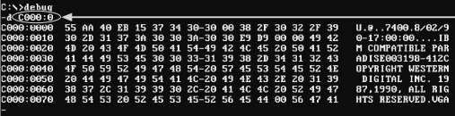

> The Tao produced One; One produced Two; Two produced Three; Three produced All things. \
-- Lao-tzu

- [UML](#uml)
  - [What is it?](#what-is-it)
      - [What is it not](#what-is-it-not)
  - [What is it used for?](#what-is-it-used-for)
  - [Classifications of UML Diagrams](#classifications-of-uml-diagrams)
    - [Structural Diagrams](#structural-diagrams)
    - [Behavioral Diagrams](#behavioral-diagrams)
  - [Types of UML Diagrams](#types-of-uml-diagrams)
    - [Use Case Diagram](#use-case-diagram)
      - [Description](#description)
      - [Key components](#key-components)
    - [Class Diagram](#class-diagram)
      - [Description](#description-1)
      - [Key components](#key-components-1)
    - [Sequence Diagram](#sequence-diagram)
      - [Description](#description-2)
      - [Key components](#key-components-2)
    - [State Diagram](#state-diagram)
      - [Description](#description-3)
      - [Key components](#key-components-3)
    - [Activity Diagram](#activity-diagram)
      - [Description](#description-4)
      - [Key components](#key-components-4)
    - [Hybrids](#hybrids)
      - [Swimlane Diagram](#swimlane-diagram)
      - [Custom](#custom)
- [Set Theory](#set-theory)
  - [Definition of a Set](#definition-of-a-set)
  - [Set Notation](#set-notation)
    - [Examples](#examples)
    - [Logical Connectives](#logical-connectives)
    - [Subsets and Supersets](#subsets-and-supersets)
  - [Venn Diagrams](#venn-diagrams)
- [Numbering Systems](#numbering-systems)
  - [Everyday Numbering Systems](#everyday-numbering-systems)
    - [Base 10](#base-10)
    - [Base 12 and 24](#base-12-and-24)
    - [Base 60](#base-60)
  - [Computing Numbering Systems](#computing-numbering-systems)
    - [Binary](#binary)
      - [Why is it Used?](#why-is-it-used)
      - [Examples](#examples-1)
        - [Digital Signals](#digital-signals)
        - [Computation](#computation)
      - [Metric System for Binary](#metric-system-for-binary)
    - [Hexadecimal](#hexadecimal)
      - [Why is it Used?](#why-is-it-used-1)
      - [Examples](#examples-2)
        - [Memory Addresses](#memory-addresses)
        - [Colors](#colors)
  - [Converting Between Bases](#converting-between-bases)
  - [Binary Arithmetic and Encodings](#binary-arithmetic-and-encodings)
    - [Binary Addition](#binary-addition)
    - [One's Complement Encoding](#ones-complement-encoding)
    - [Two's Complement Encoding](#twos-complement-encoding)
- [Encoding Text for Computing](#encoding-text-for-computing)
  - [ASCII (American Standard Code for Information Interchange)](#ascii-american-standard-code-for-information-interchange)
    - [How many values?](#how-many-values)
    - [What Kinds of Characters?](#what-kinds-of-characters)
      - [Control Characters](#control-characters)
      - [Printable Characters](#printable-characters)
        - [Numbers](#numbers)
        - [Letters](#letters)
        - [Punctuation and Symbols](#punctuation-and-symbols)
  - [Unicode (Universal Character Set)](#unicode-universal-character-set)
    - [How many values?](#how-many-values-1)
      - [UTF-8 (8-bit Unicode Transformation Format)](#utf-8-8-bit-unicode-transformation-format)
      - [UTF-16 (16-bit Unicode Transformation Format)](#utf-16-16-bit-unicode-transformation-format)
      - [UTF-32 (32-bit Unicode Transformation Format)](#utf-32-32-bit-unicode-transformation-format)
    - [What Kinds of (additional) Characters?](#what-kinds-of-additional-characters)
      - [Scripts (writing systems)](#scripts-writing-systems)
      - [Mathematical symbols](#mathematical-symbols)
      - [Currency](#currency)
      - [Notational Systems](#notational-systems)
      - [Emojis](#emojis)
    - [Usage](#usage)


## Announcements

- There will be assignment for numeric encodings; will be due day of final.
- Final exam **practical** is cancelled.
    - Written exam still on.

## Agenda

- Start numeric lecture
- Text encoding lecture
- Next time:
  - Finish numeric lecture

- Next Monday:
    - Leftovers
    - Review - study guide

# UML

## What is it?

**UML** = Unified Modeling Language

- Standardized way to model software. 
- Visual language that allows us to communicate the design of a system.
- Primary authors are Grady Booch, James Rumbaugh, and Ivar Jacobson.
- Solved problem of competing / differing documentation styles.
    - You can show UML to someone anywhere in the world and they will understand it.

These diagrams capture information about various contexts.

- Roles of people building / maintaining / using the software.
- Hardware involved.
- Functionality of the system, in various scopes and levels of detail.

#### What is it not
- UML is _not_ a programming language. It's a visual description language.

## What is it used for?

- Planning new functionality for software.
- Reference when modifying existing functionality.
- Communicating with stakeholders (documentation).
- Training new team members.

## Classifications of UML Diagrams

<figure>
    <span>
        
    </span>
    <figcaption>
        <a href="https://www.visual-paradigm.com/guide/uml-unified-modeling-language/uml-practical-guide/">
        </a>
    </figcaption>
</figure>

### Structural Diagrams

Show static relationships between system components; anatomy of a system.

Types include:
- Class Diagram
- Object Diagram
- Component Diagram
- Deployment Diagram
- Package Diagram
- Composite Structure Diagram

### Behavioral Diagrams

Show dynamic interactions between system components; behavior of a system.

Types include:
- Use Case Diagram
- Activity Diagram
- State Machine Diagram
- Sequence Diagram
- Communication Diagram
- Timing Diagram

## Types of UML Diagrams

From [An introduction to the Unified Modeling Language - IBM Developer](https://developer.ibm.com/articles/an-introduction-to-uml/):

> "The most useful, standard UML diagrams are: use-case diagram, class diagram, sequence diagram, statechart diagram, activity diagram, component diagram, and deployment diagram."

### Use Case Diagram


<figure>
    <span>
        
    </span>
    <figcaption>
        <a href="https://drawio-app.com/wp-content/uploads/2018/10/UseCase-HabitTrackingApp.png">
            Use case diagram for habit tracking app.
        </a>
    </figcaption>
</figure>

#### Description

- Represent functionality, actors, and how these relate to each other in the context of a system.
- "High level" scope; not much detail.
- Useful for planning new functionality.
- Useful for communicating with stakeholders.

#### Key components

- Actors
- Use cases
- Relationships between actors and use cases
    - *Optionally, relationships between use cases (includes / extends)
- System boundaries

### Class Diagram

<figure>
    <span>
        
    </span>
    <figcaption>
        <a href="https://drawio-app.com/wp-content/uploads/2018/01/Class-Diagram-Habit-Tracker-app.png">
            Class diagram for a habit tracking app.
        </a>
    </figcaption>
</figure>

#### Description

- Shows how entities (classes) in a system relate to each other.
- Classes contain self-describing attributes and methods.
- Connectors between classes show **cardinality**; how many of one class can be related to another class.
    - https://www.uml-diagrams.org/multiplicity.html
    - Also... Crow's feet notation.

| Multiplicity | Option | Cardinality                             |
| :----------- | :----- | :-------------------------------------- |
| 0..0         | 0      | Collection must be empty                |
| 0..1         |        | No instances or one instance            |
| 1..1         | 1      | Exactly one instance                    |
| 0..*         | *      | Zero or more instances                  |
| 1..*         |        | At least one instance                   |
| 5..5         | 5      | Exactly 5 instances                     |
| m..n         |        | At least m but no more than n instances |

- Entities can be concrete or abstract. From above:
  - Concrete examples:
    - Person
    - ??? (what else?)
  - Abstract examples:
    - Comment
    - ??? (what else?)

#### Key components

- Classes
- Attributes
- Methods
- Relationships between classes (cardinality)
 <br>
<span class="demo">walkthrough:</span> For dog walking service, how would I show…
- Dog walker and client (person)?
- Dogs that he/she is scheduled to walk?
- Relationships?
- Any other classes needed?

### Sequence Diagram

<figure>
    <span>
        
    </span>
    <figcaption>
        <a href="https://drawio-app.com/wp-content/uploads/2018/02/drawio-sequence-checkin.png">
            Sequence diagram for a habit tracking app.
        </a>
    </figcaption>
</figure>

#### Description

- Shows interactions between objects in a system...
   - over time
   - for a specific use case

What has to happen before another thing happens? Who is involved?

#### Key components

- Actors
- Lifelines
- Messages
- Activation boxes

### State Diagram

<figure>
    <span>
        
    </span>
    <figcaption>
        <a href="https://www.softwareideas.net/a/1805/user-login-uml-state-machine-diagram-">
            State diagram for login.
        </a>
    </figcaption>
</figure>

#### Description

Shows states of a system and how it transitions between them.

#### Key components

- States
- Transitions

<br>
<span class="demo">walkthrough:</span> Make a state diagram for a turnstile.
- What states?
- What transitions?

### Activity Diagram

<figure>
    <span>
        
    </span>
    <figcaption>
        <a href="https://www.visual-paradigm.com/guide/uml-unified-modeling-language/what-is-activity-diagram/">
            Activity diagram for order processing.
        </a>
    </figcaption>
</figure>

#### Description

- Models the flow of control from one activity to another.
- Shows logic without implementation detail.

#### Key components

- Activities
- Transitions
- Branching / merging
- Forking / joining

### Hybrids

#### Swimlane Diagram

<figure>
    <span>
        
    </span>
    <figcaption>
        <a href="https://www.officetimeline.com/swimlane-diagram">
            Swimlane diagram for student application.
        </a>
    </figcaption>
</figure>

- Like an activity diagram... with swimlanes.
- Swimlanes show boundaries between actors / roles in system.


#### Custom

It’s useful to have a baseline knowledge of UML if you work with software at all. Even rough sketches can save valuable communication time.

Mix and match to suit your needs.

# Set Theory

<!-- ref: https://docs.google.com/document/d/1xrltP4pU9FkZtHtX5-glQ-6xtKQ17o1C2PjoDaTsWKo/edit -->

> Bertrand Russell and Ernst Zermelo independently found the simplest and best known paradox, now called Russell's paradox: consider "the set of all sets that are not members of themselves", which leads to a contradiction since it must be a member of itself and not a member of itself.

## Definition of a Set

A **set** is a collection of objects with...
- No duplicates.
- No order.


## Set Notation

- Sets are usually assigned a capital letter. 
- Elements are wrapped in curly braces.
- Objects in a set are called **elements**.
- Numbers of elements in a set are called **cardinality**.

### Examples

- Let A be the set of all even numbers between 1 and 10.
- Let B be all integers.
- Let C be all distinct letters in the word "apple".
- Let D = { 'dog', 'cat', 'elephant' }

### Logical Connectives

Logical connectives (and, or) are usually rounded when used in set theory.

| Operation | Symbol (alt) | Symbol (Set Theory) | Description |
| :-------: | :----------: | :-----------------: | :---------: |
|    and    |      ∧       |          ∩          | conjunction |
|    or     |      ∨       |          ∪          | disjunction |

### Subsets and Supersets

A **subset** is a set that contains all elements of another set.
A **proper subset** is a subset that is not equal to the original set.

Examples:
- { 1, 2, 3 } is a subset of { 1, 2, 3, 4, 5 }
- { 1, 2, 3 } is a proper subset of { 1, 2, 3, 4, 5 }
- { 1, 2, 3 } is not a proper subset of { 1, 2, 3 }

## Venn Diagrams

<figure>
    <span>
        
    </span>
    <figcaption>
        Logical operations on sets.
    </figcaption>
</figure>

Venn diagrams help us visualize relationships between sets.

- Sets represented as circles.
- Overlapping area represents intersection of sets (logical and).
- Overlapping + non-overlapping area represents union of sets (logical or).
- What would XOR look like?


<br>
<p class="demo">Quiz: </p>

<figure>
    <span>
        
    </span>
    <figcaption>
        Logical operations on sets.
    </figcaption>
</figure>

<details>
    <summary>Find the expression that represents the area outlined in red.</summary>
    <div>
        <p>( A ∪ B ) ∩ ¬C</p>
    </div>
</details>

<br>
<p class="demo">Quiz: </p>

- Let A = { dog, oak, cherry, red, cow }
- Let B = { oak, dog, cow, elm, maple, goose }
- Let C = { door, silk }

<details>
    <summary>Find the elements in the set: C ∩ A ∪ B</summary>
    <div>
        <p>( C ∩ A ) ∪ B</p>
        <p>{ } ∪ B</p>
        <p>{ } ∪ { oak, dog, cow, elm, maple, goose }</p>
        <p>{ oak, dog, cow, elm, maple, goose }</p>
    </div>
</details>


# Numbering Systems

We can use any number of symbols to represent the same numeric value.

Example: write the number “ten” in base 1 through 10

| Base | Symbols                                            | Representation 10<sub>(10)</sub> |
| :--- | :------------------------------------------------- | -------------------------------: |
| 1    | { 1 }                                              |                       1111111111 |
| 2    | { 0, 1 }                                           |                             1010 |
| 3    | { 0, 1, 2 }                                        |                              101 |
| 4    | { 0, 1, 2, 3 }                                     |                               22 |
| 5    | { 0, 1, 2, 3, 4 }                                  |                               20 |
| 6    | { 0, 1, 2, 3, 4, 5 }                               |                               14 |
| 7    | { 0, 1, 2, 3, 4, 5, 6 }                            |                               13 |
| 8    | { 0, 1, 2, 3, 4, 5, 6, 7 }                         |                               12 |
| 9    | { 0, 1, 2, 3, 4, 5, 6, 7, 8 }                      |                               11 |
| 10   | { 0, 1, 2, 3, 4, 5, 6, 7, 8, 9 }                   |                               10 |
| ...  | ...                                                |                              ... |
| 16   | { 0, 1, 2, 3, 4, 5, 6, 7, 8, 9, A, B, C, D, E, F } |                                A |

## Everyday Numbering Systems

### Base 10

- Our "counting" numbering system.
- Probably evolved from counting on fingers.

### Base 12 and 24

- Used for time
    - 12 hours in half day
    - 24 hours in day
- Theory of why? 
  - Twelve bones on non-thumb fingers that can be counted with the thumb.

### Base 60

- Used for time
    - 60 seconds in minute
    - 60 minutes in hour

## Computing Numbering Systems

### Binary

**_Base 2_**

{ 0, 1 }

#### Why is it Used?

- Digital signal can be in one of two states: 
    - **_Off = 0_**
    - **_On = 1_**

#### Examples

##### Digital Signals

<figure>
    <span>
        
    </span>
    <figcaption>
        <a href="https://www.electronicshub.org/analog-circuits-and-digital-circuits/">
            Analog vs Digital Signal - Top is electrical signal, bottom is digital signal.
        </a>
    </figcaption>
</figure>

- Measuring electrical signal as it comes into circuit.
- Use a threshold function to determine if a signal is on or off.

##### Computation

All of modern computing can be represented in binary.
- Command codes
- Data
- Memory addresses
- ...

#### Metric System for Binary

| Term      | Abbreviation |              Binary Size |          ~Range | Example Usage         |
| :-------- | :----------- | -----------------------: | --------------: | :-------------------- |
| byte      | b            |                   8 bits |             256 | A character.          |
| kilobyte  | KB or kB     |  2<sup>10</sup> = 1024 b |    one thousand | A text file.          |
| megabyte  | MB           | 2<sup>10</sup> = 1024 KB |     one million | A photo file.         |
| gigabyte  | GB           | 2<sup>10</sup> = 1024 MB |     one billion | A video file.         |
| terabyte  | TB           | 2<sup>10</sup> = 1024 GB |    one trillion | Hard drive capacity.  |
| petabyte  | PB           | 2<sup>10</sup> = 1024 TB | one quadrillion | Data center capacity. |
| exabyte   | EB           | 2<sup>10</sup> = 1024 PB | one quintillion | Supercomputer FLOPS   |
| zettabyte | ZB           | 2<sup>10</sup> = 1024 EB |  one sextillion | ...                   |
| yottabyte | YB           | 2<sup>10</sup> = 1024 ZB |  one septillion | ...                   |

- Mb = megabit
    - Not to be confused with MB = megabyte
    - Used in telecommunications to measure bandwidth (e.g. Internet speeds).
    - 1 Mb = 1,000,000 bits
    - 1 MB = 1,048,576 bits

1024 b / KB

<details>
    <summary>Given a file that is 564,707,328 bytes, find its size in MB.</summary>
    <div>
        <p>Cancel units until we get to where we need to be...</p>
        <p>564,707,328 bytes * (1 KB / 1024 byte) = 551,472 KB</p>
        <p>551,472 KB * (1 MB / 1024 KB) = 538.55 MB</p>
        <p>Answer: 538.55 MB</p>
    </div>
</details>

Can we go the other way?
- Find a file on disk on MB scale and figure out how many bytes.
- Check result with Windows Explorer "properties".
- (May not be exact match due to file system overhead.)

### Hexadecimal

**_Base 16_**

{ 0, 1, 2, 3, 4, 5, 6, 7, 8, 9, A, B, C, D, E, F }

- Often prefixed with “0x”, e.g:
    - 0x4F

#### Why is it Used?

- Binary numbers get really long. Hex is more compact.
- Easier to convert binary to hex than to decimal.

#### Examples

##### Memory Addresses

e.g., in a memory dump after a program crash

<figure>
    <span>
        
    </span>
    <figcaption>
        Memory Addresses in Hex
    </figcaption>
</figure>

##### Colors

- Represented as RGB (red, green, blue) values.
- Usually has a pound sign when used for color.
- Values are from 0-255 for each component
    - #<span style="color: red">FF</span>0000 = red
    - #00<span style="color: green">FF</span>00 = green
    - #0000<span style="color: blue">FF</span> = blue
    - #<span style="color: #FF00FF">FF</span>00<span style="color: #FF00FF">FF</span> = magenta(?) 

<p class="demo">Demo:</p>

- Let's change the bg color on Google's search page...

<p class="demo">Demo:</p>

```bash
## Each 2 hex digits is a byte.
## In a text file, each byte is a character.
xxd some_file.txt | head

## Now let's check the binary... pretty long
xxd -b some_file.txt | head
```
<br>
<br>
<mark>TODO: complete - left off here</mark>

## Converting Between Bases

<!-- Ref: https://docs.google.com/document/d/1WJj9YJb5upftC4Tf81llDjUpONqWI0RlHOmui1N-mYg/edit -->


## Binary Arithmetic and Encodings

### Binary Addition

<!-- ### Bitwise Operations -->

<!-- #### Bitmasking -->

<!-- #### Bitshifting -->

### One's Complement Encoding

### Two's Complement Encoding


# Encoding Text for Computing

<figure>
    <span>
        
    </span>
    <figcaption>
        <a href="https://blog.unicode.org/2021/08/">
            The Unicode Blog
        </a>
    </figcaption>
</figure>

A computer can only store numbers, so we need a way to represent text as numbers.

<p class="demo">Demo:</p>

- m02_letter_is_capital.py 

## ASCII (American Standard Code for Information Interchange)

Origins in telegraphy from Bell during 1960s.

Very widely used today.

**_Summary:_**

- ASCII is a small and concise way to represent typical usage “text” characters.

### How many values?

Each character is mapped to a number.

7-bit ASCII is the original standard
- 2<sup>7</sup> = 128 characters

### What Kinds of Characters?

Reference: https://www.ascii-code.com/

#### Control Characters

- Backspace
- Carriage return
- Line feed
- Tab
- Bell
- ...

Many of these, e.g. bell, were used for old printers.

#### Printable Characters

##### Numbers

- 0-9

##### Letters

- A-Z
- a-z

##### Punctuation and Symbols

- ! " # $ % & ' ( ) * + , - . / : ; < = > ? @ [ \ ] ^ _ ` { | } ~ ;
- ...

## Unicode (Universal Character Set)

### How many values?

As of Unicode 15.1, there are 157,492 characters in the Unicode Standard

ACII is a subset of Unicode.
- This means everything from ASCII is included in Unicode.

**_Summary:_**

- Unicode can represent more symbols than ASCII but uses more memory due to larger charter encoding.

#### UTF-8 (8-bit Unicode Transformation Format)

- Variable length encoding: Number of bytes per character varies.
    - Most common characters are 1 byte.
    - Can be up to 4 bytes.
- 8-bit ASCII is a subset of UTF-8.
- See: HTML head section of web page.
```html
    <meta charset="UTF-8">
```

#### UTF-16 (16-bit Unicode Transformation Format)

- Fixed length encoding: Always 2 bytes per character.
- Greater efficiency at cost of storage space.
- Necessary for some languages.

#### UTF-32 (32-bit Unicode Transformation Format)

- Fixed length encoding: Always 4 bytes per character.
- Greater effieciency at cost of storage space.
- Necessary for some languages.

### What Kinds of (additional) Characters?

Reference: https://unicode.org/charts/

#### Scripts (writing systems)

- Cyrillic
    - А Б В Г Д Е Ё Ж З И Й К Л М Н О П Р С Т У Ф Х Ц Ч Ш Щ Ъ Ы Ь Э Ю Я
- Greek
    - Α Β Γ Δ Ε Ζ Η Θ Ι Κ Λ Μ Ν Ξ Ο Π Ρ Σ Τ Υ Φ Χ Ψ Ω
- Armenian
    - Ա Բ Գ Դ Ե Զ Է Ը Թ Ժ Ի Լ Խ Ծ Կ Հ Ձ Ղ Ճ Մ Յ Ն Շ Ո Չ Պ Ջ Ռ Ս Վ Տ Ր Ց Ւ Փ Ք Օ Ֆ
- Hebrew
    - א ב ג ד ה ו ז ח ט י כ ל מ נ ס ע פ צ ק ר ש ת
- Arabic
    - ا ب ت ث ج ح خ د ذ ر ز س ش ص ض ط ظ ع غ ف ق ك ل م ن ه و ي
- ...

#### Mathematical symbols

- Greek letters
    - α β γ δ ε ζ η θ ι κ λ μ ν ξ ο π ρ ς σ τ υ φ χ ψ ω
- Operators
    - + - × ÷ = ≠ < > ≤ ≥ ≈ ≡ ≈ ∞ √ ∑ ∏ ∫ ∂ ∇ ∆ √ ∛ ∜ ∝ ∟ ∠ ∡ °
- Arrows
    - ← → ↑ ↓ ↔ ↕ ↖ ↗ ↘ ↙ ↚ ↛ ↜ ↝ ↞ ↟ ↠ ↡ ↢ ↣ ↤ ↥ ↦ ↧ ↨ ↩ ↪ ↫ ↬ ↭ ↮ ↯ ↰ ↱ ↲ ↳ ↴ ↵ ↶ ↷ ↸ ↹ ↺ ↻ ↼ ↽ ↾ ↿ ⇀ ⇁ ⇂ ⇃ ⇄ ⇅ ⇆ ⇇ ⇈ ⇉ ⇊ ⇋ ⇌ ⇍ ⇎ ⇏ ⇐ ⇒ ⇑ ⇓ ⇔ ⇕ ⇖ ⇗ ⇘ ⇙ ⇚ ⇛ ⇜ ⇝ ⇞ ⇟ ⇠ ⇡ ⇢ ⇣ ⇤ ⇥ ⇦ ⇧ ⇨ ⇩ ⇪ ⇫ ⇬ ⇭ ⇮ ⇯ ⇰ ⇱ ⇲ ⇳ ⇴ ⇵ ⇶ ⇷ ⇸ ⇹ ⇺ ⇻ ⇼ ⇽ ⇾ ⇿
- ...

#### Currency

- $ € £ ¥ ¢ ₽ ₩ ₱ ₿ ฿ ₫ ₴ ₸ ₮ ₵ ₲ ₪ ₡

#### Notational Systems

- Braille
    - ⠠ ⠡ ⠢ ⠣ ⠤ ⠥ ⠦ ⠧ ⠨ ⠩ ⠪ ⠫ ⠬ ⠭ ⠮ ⠯ ⠰ ⠱ ⠲ ⠳ ⠴ ⠵ ⠶ ⠷ ⠸ ⠹ ⠺ ⠻ ⠼ ⠽ ⠾ ⠿
- Musical notation
    - ♩ ♪ ♫ ♬ ♭ ♮ ♯
- Alchemy
    - 🜁 🜂 🜃 🜄 🜅 🜆 🜇 🜈 🜉 🜊 🜋 🜌 🜍 🜎 🜏
- Chess
    - ♔ ♕ ♖ ♗ ♘ ♙ ♚ ♛ ♜ ♝ ♞ ♟

#### Emojis

Book of Genesis (per ChatGPT):

🌌🪶🌍🌿🚶‍♂️🚶‍♀️ 🍎🐍👫🚪 🌊🚶‍♂️🚢 🏞️🕊️🍃 🌈🚪🪣🌧️ 👨‍👩‍👧‍👦🌾🐄🐑🐓 🌆🧱🗼 🌍🚪👥🚚 🌄🛏️🌅

### Usage

- An application can display a character only if it can access a font which contains a glyph for the character.
- Very few fonts have full Unicode coverage;
    - If I try to type Egyptian on my PC, it won't work.

- _Windows_: To insert an ASCII character, press and hold down ALT while typing the character code. For example, to insert the degree (º) symbol, press and hold down ALT while typing 0176 on the numeric keypad.

- _Mac_: To insert an ASCII character, press and hold down Option while typing the character code. For example, to insert the degree (º) symbol, press and hold down Option while typing 0176 on the numeric keypad.
  
- Random Trivia: �
    - "replacement character" (U+FFFD) and is used to indicate problems when a system is unable to render a stream of data to a correct symbol.
