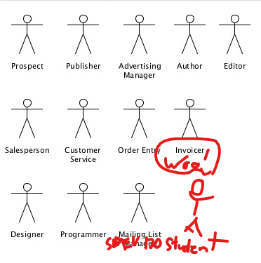

- [Unified Modeling Language (UML)](#unified-modeling-language-uml)
  - [Background](#background)
  - [What is UML?](#what-is-uml)
  - [Do We Really Need to Know All This?](#do-we-really-need-to-know-all-this)
  - [Type of Information in UML](#type-of-information-in-uml)
  - [When to Use UML](#when-to-use-uml)
  - [Diagram Classifications](#diagram-classifications)
    - [Structural Diagrams](#structural-diagrams)
      - [Use Case Diagram](#use-case-diagram)
        - [Description](#description)
        - [Key components](#key-components)
      - [Class Diagram](#class-diagram)
    - [Behavioral Diagrams](#behavioral-diagrams)

<figure>
    
        
    
</figure>

# Unified Modeling Language (UML)

Reference: [UML Diagrams](https://drawio-app.com/blog/uml-diagrams)

## Background

Prior to UML...

- Different notations and diagrams
- Everyone confused

Now, with UML...

- Created by Grady Booch, Ivar Jacobson, and James Rumbaugh in 1997

## What is UML?

_Not_ a programming language

- Set of diagrams and notations used to model software systems.
- Universal, culture invariant, and so much fun!

**_Hooray standards!_**

## Do We Really Need to Know All This?

Per [IBM: An introduction to the Unified Modeling Language](https://developer.ibm.com/articles/an-introduction-to-uml/):

> The most useful, standard UML diagrams are: use-case diagram, class diagram, sequence diagram, statechart diagram, activity diagram, component diagram, and deployment diagram.

Different domains use some more than others.

## Type of Information in UML

Shows system defined at different scopes in varying levels of detail.

- Roles of people
- Hardware components
- Software components
- Functionality
- Data
- Response to events
- etc.

## When to Use UML

- Planning new systems / functionality
- Documenting existing systems
- Training new team members
- Communicating with stakeholders

## Diagram Classifications

<figure>
    
        
    
</figure>

### Structural Diagrams

**Structural Diagrams** show the static relationships between the components of a system.

"Anatomy" of the system.

#### Use Case Diagram

<figure>
    
        
    
</figure>

##### Description

- Represent functionality, actors, and how these relate to each other in the context of a system.
- "High level" scope; not much detail.
- Useful for planning new functionality.
- Useful for communicating with stakeholders.

##### Key components

- Actors
- Use cases
- Relationships between actors and use cases
  - \*Optionally, relationships between use cases (includes / extends)
- System boundaries

#### Class Diagram

### Behavioral Diagrams

**Behavioral Diagrams** show interactions and changes within the system.

"Physiology" of the system.
