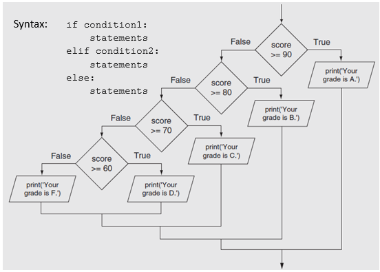

- [Comparison and Boolean Expressions](#comparison-and-boolean-expressions)
  - [Comparison Operators](#comparison-operators)
  - [Boolean and Propositional Expressions](#boolean-and-propositional-expressions)
  - [Truth Tables](#truth-tables)
    - [Conjunction](#conjunction)
    - [Disjunction](#disjunction)
    - [Syntax and Parse Trees](#syntax-and-parse-trees)
- [Decision Structures](#decision-structures)
  - [Single Alternative - the `if` Statement](#single-alternative---the-if-statement)
  - [Dual Alternative - the `if, else` Statement](#dual-alternative---the-if-else-statement)
  - [Fallthrough decisions - the `if, else if, else` Statement](#fallthrough-decisions---the-if-else-if-else-statement)
  - [Nested Decision Structures](#nested-decision-structures)
    - [Boolean Variable Naming Best Practices](#boolean-variable-naming-best-practices)
- [Functions](#functions)
  - [Overview: Why Functions?](#overview-why-functions)
    - [Code Reuse](#code-reuse)
    - [Code Consistency](#code-consistency)
    - [Code Organization](#code-organization)
    - [Code Readability](#code-readability)
    - [Code Testability](#code-testability)
    - [Code Modularity / Portability](#code-modularity--portability)
  - [The Call Stack](#the-call-stack)
    - [Stack Data Structure](#stack-data-structure)
    - [Stack Frames](#stack-frames)
    - [Call Stack](#call-stack)
  - [Function Composition](#function-composition)
  - [Recursion](#recursion)
  - [Variable Scope](#variable-scope)
  - [Tying it All Together](#tying-it-all-together)


> I met a traveller from an antique land, \
> Who said—“Two vast and trunkless legs of stone \
> Stand in the desert. . . . Near them, on the sand, \
> Half sunk a shattered visage lies, whose frown, \
> And wrinkled lip, and sneer of cold command, \
> Tell that its sculptor well those passions read \
> Which yet survive, stamped on these lifeless things, \
> The hand that mocked them, and the heart that fed; \
> And on the pedestal, these words appear: \
> My name is Ozymandias, King of Kings; \
> Look on my Works, ye Mighty, and despair! \
> Nothing beside remains. Round the decay \
> Of that colossal Wreck, boundless and bare \
> The lone and level sands stretch far away. \
> <span class="attr">--Percy Bysshe Shelley</span>

## Announcements

- Lab submission requirement changed for previous lab.

## Agenda

- fstrings?
- Lecture

# Comparison and Boolean Expressions

Lecture outline:

- Best practices for variable naming (positive vs negative naming)
- Comparison operators in Python
- Indentation and code blocks
- `if` statements

- `if-else` statements
  - when to use each?
- `if-else if-else` statements

## Comparison Operators

A comparison operation compares two expressions and evaluates to a boolean value.

| Operator | Meaning                  | Example  |
| -------- | ------------------------ | -------- |
| `==`     | Equal to                 | `a == b` |
| `!=`     | Not equal to             | `a != b` |
| `>`      | Greater than             | `a > b`  |
| `<`      | Less than                | `a < b`  |
| `>=`     | Greater than or equal to | `a >= b` |
| `<=`     | Less than or equal to    | `a <= b` |

## Boolean and Propositional Expressions

Boolean expressions may be unary or binary. Unary expressions have one operand, binary expressions have two operands. Of the ones below, only `not` is unary.

| Connective  | Propositional Logic Symbol | Python Operator | Precendence |
| ----------- | -------------------------- | --------------- | ----------- |
| Grouping    | `()`                       | ()              | 1           |
| Negation    | `¬`                        | `not`           | 2           |
| Conjunction | `^`                        | `and`           | 3           |
| Disjunction | `v`                        | `or`            | 4           |
| Implication | `->`                       | `if...`         | 5           |

Boolean variables in Python take on the keyword values `True` and `False`.

```python
## Simple comparisons of two boolean variables
a = True
b = False
print( f'{a} and {b} = {a and b}' )
print( f'{a} or {b} = {a or b}' )
```

Review: double negation

## Truth Tables

### Conjunction

| A     | B     | A and B |
| ----- | ----- | ------- |
| True  | True  | True    |
| True  | False | False   |
| False | True  | False   |
| False | False | False   |

### Disjunction

| A     | B     | A or B |
| ----- | ----- | ------ |
| True  | True  | True   |
| True  | False | True   |
| False | True  | True   |
| False | False | False  |

<p class="demo">Demo:</p>
Review quiz from last time.

### Syntax and Parse Trees


<p class="demo">Demo:</p>

What does this parse tree represent?

Do some more examples with boolean logic:W

# Decision Structures

GOALS:

- Understand how decisions can be used to change the flow of a program based on a boolean expression.
- Understand when to use single vs dual selection structures.
- Understand flow of execution in the case of single, dual, or multiple decision outcomes (if; if/else; if/elif/else)
- Understand how execution flows through nested decisions.
- Understand how compound boolean expressions can be used to make a single decision.
- Be able to convert nested decision into an equivalent compound boolean expression.

## Single Alternative - the `if` Statement

A **single alternative decision structure** yields control to a process only if some boolean expression is true.


Single alternative example: Charge customer for shirt.
“Customer is a rewards member”?
If true - apply discount. Since no action is needed in the case of a false condition, we don’t need any action.

Statements that are evaluated based upon the truthfulness of some condition are nested under an if statement.

Anything inside the code block (indented at the if’s level) will be evaluated only if the “if” expression evaluates to true.

The expression for the if statement can be arbitrarily complex - the only constraint is that it must evaluate to True or False.

Examples:

```python
if x:
if x == True:
if has_account == False:
if a > b:
if is_admin and current_page == 'User Management':
if is_admin == False or user_logged_in == False:
```

<p class="demo">Demo:</p>

Algorithm - flowchart and Python:
Number is even (single dec. st.)

## Dual Alternative - the `if, else` Statement

A **dual alternative decision structure** yields control to one of two processes based on the truthfulness of a given boolean condition.


Dual alternative example: Open communication channel with landing aircraft.

- “Runway is clear?”
  - True - Direct aircraft to land.
  - False - Send aircraft to hold pattern.

<p class="demo">Demo:</p>
Algorithm - flowchart and Python:
Number is even/odd (dual dec. st.)

## Fallthrough decisions - the `if, else if, else` Statement

We can chain together arbitrary amounts of decisions to represent “fallback logic” - if, else if, else if, … else.

We do not always need a final “else”.



What happens if we don't use else if here?

<p class="demo">Demo:</p>

m03_if_elif_else.py

## Nested Decision Structures

We can put decision structures into the flow of execution from another decision. These are called nested decisions.

_Note:_ We don’t want to duplicate decision logic if possible. Often times we can extract a decision that would otherwise be nested.

<p class="demo">Demo:</p>

Program: What to wear based on temperature.

- possible outcomes:
  - snowing, not snowing - temp <= 32
  - raining, not raining - temp > 32
  - cold, coat - temp < 45
  - mild, jacket - temp < 70
- e.g. outcome statements
  - It is rainy and warm. You need a jacket and umbrella.
  - It is clear and mild. You need a jacket.
  - It is snowy and cold. You need a coat.
- Which variables are inputs?
  - temperature
  - precipitation

<p class="demo">Demo:</p>

Write program to figure out if letter is capital

- Hint: look at ASCII / Unicode - https://www.ascii-code.com/
- Hint: Python uses ord() and int() functions
- m02_letter_is_capital_v1.py

### Boolean Variable Naming Best Practices

It’s good practice to name boolean variables in the positive rather than the negative. Otherwise statements get confusing.

```python
## Not great...
if not not_logged_in:
## Better
if logged_in:
```

The “== True” portion of a boolean expression is implied. Whether you choose to put it in is a style choice.

```python
## These two are the same
if x:
    print( 'True' )
if x == True:
    print( 'True' )

## These are also the same
if not x:
    print( 'False' )
if x == False:
    print( 'False' )
```

# Functions

## Overview: Why Functions?

### Code Reuse

- **Don't Repeat Yourself** (DRY) principle

### Code Consistency

- One version of a function for all callers.

### Code Organization

- Break up large programs into smaller, more manageable pieces.
- **Single responsibility principle**: function should have a single, well-defined responsibility / purpose.

### Code Readability

- Descriptive function names make code self-documenting.
- Usually start with a verb, except for boolean checks.

_Example Function Names_

User input:

- `get_user_input()`
- `get_user_input_as_int()`

Getters and setters:

- `get_account_balance()`
- `update_account_balance()`

Boolean checks:

- `is_user_logged_in()`
- `is_user_admin()`

Data processing:

- `calculate_tax()`
- `filter_items_by_user()`

### Code Testability

- Unit testing

### Code Modularity / Portability

- Functions can be used by other parts of the same program.
- Functions can be used by different programs.

<p class="demo">Demo:</p>

m04_create_truth_table.py

## The Call Stack

### Stack Data Structure

LIFO (last in, first out) data structure.

<figure>
    <span>
        
    </span>
    <figcaption>
        <a href="https://medium.com/@todoroski97/data-structure-stack-17b80ed3bfa9">The Stack Data Structure</a>
    </figcaption>
</figure>

### Stack Frames

A stack frame:

- Represents the execution context of a single function call.
- Contains all data relevant to the function call.
- Exists only during the execution of a function call.

### Call Stack

The call stack:

- Keeps track of the sequence of function calls in a program
- Is composed of stack frames
- Exists for the lifetime of a program

**Stack overflow** = when the call stack grows too large, and the program runs out of memory.

## Function Composition

- We can say that functions are **composable**.
- We can use the output of one function as the input to another function.
- We can use the output of a function as the input to itself.

Two main ways that we see this:

```python
def f( x ):
    return x + 1

def g( x ):
    return x * 2

## Composition
print( f( g( 2 ) ) )
```

Or, function chaining:

```python
text = "   Hello, World!   "
result = text.strip().lower().replace("world", "Python").capitalize()
print(result)
```

## Recursion

**Recursive function** = a function that calls itself.

```python
# Recursive function
def countUpDown(lower,upper):
    print(lower)

    if lower == upper:
        return

    countUpDown(lower + 1, upper)
    print(lower)

countUpDown(0,3)
```

## Variable Scope

**Variable scope** = the part of a program where a variable is visible.

Typically two types:

- **Global scope** = visible to entire program.
- **Local scope** = visible only within function.

<p class="demo">Demo:</p>

m02_scope_demo.py
Turtle recursion example:

## Tying it All Together

[Online Turtle Sandbox](https://www.pythonsandbox.com/turtle)

<p class="demo">Demo:</p>

draw_spiral_recursive.py

```python
import turtle

ZOOM_SCALE = 8.0
LINE_WIDTH = 7
SPEED = 5
COLORS = ['red', 'orange', 'yellow', 'green', 'blue', 'purple']
cur_color = -1


def change_color(t):
    global cur_color
    cur_color += 1
    if cur_color >= len(COLORS):
        cur_color = 0
    t.color(COLORS[cur_color])


def draw_spiral(t, line_length):
    change_color(t)
    if line_length > 0:
        t.forward(line_length * ZOOM_SCALE)
        t.right(90)
        draw_spiral(t, line_length - 5)


def main():
    t = turtle.Turtle()
    t.width(LINE_WIDTH)
    t.speed(SPEED)
    t.penup()
    t.goto(-200,200)
    t.pendown()
    draw_spiral(t, 50)
    turtle.done()


main()
```

Through the life of this program, how do the following change?

- Global variables?
- Local variables?
- The call stack?

---

Ctd. from last week

---

default parameters
type hinting
tuples
walkthrough: first lab solution
