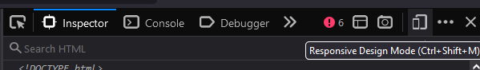

- [Responsive Design](#responsive-design)
  - [Key Concepts of Responsive Design](#key-concepts-of-responsive-design)
    - [Fluid Grids](#fluid-grids)
      - [A Responsive Grid Demo](#a-responsive-grid-demo)
    - [Fluid Media](#fluid-media)
      - [max-width](#max-width)
      - [srcset](#srcset)
      - [A Responsive Media Demo](#a-responsive-media-demo)
    - [Media Queries](#media-queries)
  - [Media Queries](#media-queries-1)
    - [The Viewport](#the-viewport)
    - [Syntax](#syntax)
    - [Width and Height](#width-and-height)
      - [Breakpoints](#breakpoints)
    - [Orientation](#orientation)
    - [Combining Media Queries](#combining-media-queries)
    - [A Media-Query Based Responsive Layout Demo](#a-media-query-based-responsive-layout-demo)
  - [Testing Responsive Design](#testing-responsive-design)

# Responsive Design

**Responsive design** is a design approach that creates dynamic changes to the appearance of a website, depending on the screen size and orientation of the device being used to view it.

## Key Concepts of Responsive Design

### Fluid Grids

- A **fluid grid** is a grid system that uses relative units to define column widths.
- 12-column grid is a common layout.
  - "960 Grid System" is a popular grid system that uses 960px as the total width of the grid.

#### A Responsive Grid Demo

TODO: responsivegrid demo

### Fluid Media

- **Fluid media** is media (images, videos, etc.) that uses relative units to define its size.

#### max-width

_Note: I gave you bad info earlier - you do not have to set the html height and width attributes for an image._

- Using CSS for specifying image dimensions rather than specifying fixed dimensions in HTML allows the image to be responsive.
- Use `max-width: 100%` to make media (e.g. images) responsive.
  - Media will shrink to fit the container.
  - Media will not grow larger than its original size.

```css
img {
  max-width: 100%;
  height: auto; /* Maintain aspect ratio */
}
```

#### srcset

- The `srcset` attribute is used to provide multiple image sources for different screen sizes.
  - List of image sources separated by commas.
  - Each image source is followed by a space and a descriptor that specifies the image's width.

```html

```

#### A Responsive Media Demo

TODO: responsive media demo

### Media Queries

- **Media queries** allows CSS rules to be applied only in certain situations.
- We will treat this topic below.

## Media Queries

### The Viewport

- The **viewport** is the user's visible area of a web page.
- The meta tag `<meta name="viewport">` allows the developer to control the viewport.
- The following attributes are commonly used:

| Attribute     | Description                                                          |
| ------------- | -------------------------------------------------------------------- |
| width         | The width of the viewport.                                           |
| height        | The height of the viewport.                                          |
| initial-scale | The initial zoom level when the page is first loaded by the browser. |
| user-scalable | Whether the user can zoom in or out.                                 |

```html
<!-- Recommended settings -->
<meta name="viewport" content="width=device-width, initial-scale=1.0" />
```

### Syntax

```css
@media type and (feature);
```

### Width and Height

Feature:

- `min-width` - apply styles if viewport is wider than specified width.
- `max-width` - apply styles if viewport is narrower than specified width.
- `min-height` - apply styles if viewport is taller than specified height.
- `max-height` - apply styles if viewport is shorter than specified height.

```css
/* Default styles */
body {
  /* Will be applied when viewport > 400px  and < 800px */
  background-color: orange;
}

@media screen and (max-width: 400px) {
  /* Styles for viewports narrower than 400 pixels. */
}

/* Styles for viewports wider than 800 pixels. */
@media screen and (min-width: 800px) {
  /* Styles for viewports wider than 800 pixels. */
}
```

#### Breakpoints

- A **breakpoint** is a point at which the layout of a web page changes.
- Breakpoints are defined by the developer.
- Common breakpoints are based on common device screen sizes.
  - 320px - smartphones
  - 768px - tablets
  - 1024px - laptops
  - 1200px - desktops
- Can be specified using media queries, and optionally CSS properties.

```css
:root {
  --breakpoint-sm: 320px;
  --breakpoint-md: 768px;
  --breakpoint-lg: 1024px;
  --breakpoint-xl: 1200px;
}

@media screen and (max-width: var(--breakpoint-sm)) {
  /* Styles for viewports smaller than 320 pixels. */
}
```

### Orientation

Feature:

- `orientation: portrait`
- `orientation: landscape`

```css
@media screen and (orientation: portrait) {
  /* Apply these styles if the device is in portrait orientation */
}
```

### Combining Media Queries

- Multiple media queries can be combined using `and`.

```css
@media (min-width: 400px) and (max-width: 600px) {
  /* Apply these styles if viewport between 400px and 600px */
  /* Apply these styles if: 
    The viewport width is 400px or larger
        AND
    The viewport width is 600px or smaller
  */
}
```

- Multiple media queries can be combined using `,` to apply the rules if any of the conditions are met.

```css
@media (max-width: 600px), (orientation: landscape) {
  /* Apply these styles if: 
    The viewport width is 600px or smaller
        OR 
    The device is in landscape orientation 
   */
}
```

### A Media-Query Based Responsive Layout Demo

TODO: DEMO

## Testing Responsive Design

Use browser developer tools to test responsive design.

- "Responsive Design Mode" in Firefox.
<figure>
    <span>
        
    </span>
</figure>

- "Device Toolbar" in Chrome.

<figure>
    <span>
        
    </span>
</figure>
