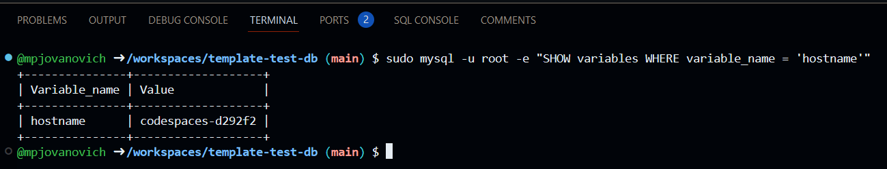
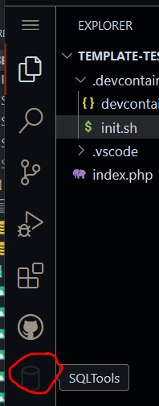
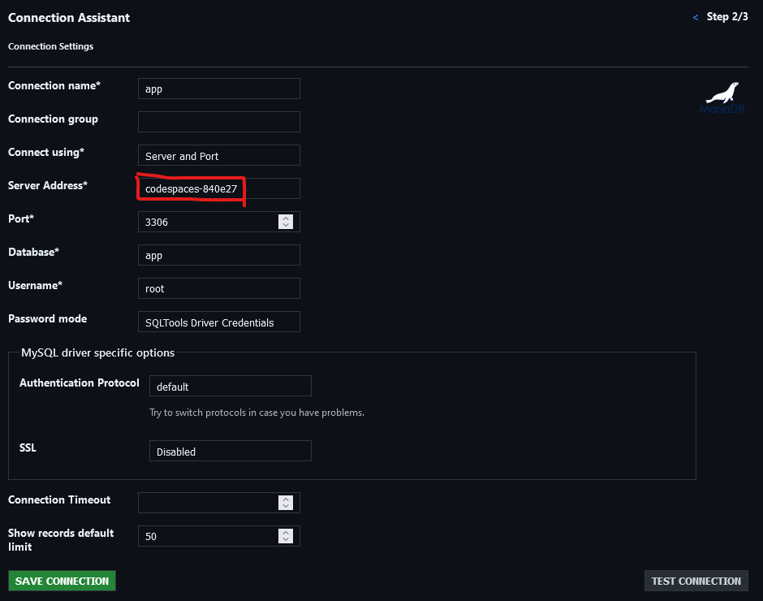
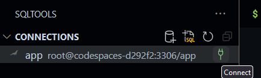
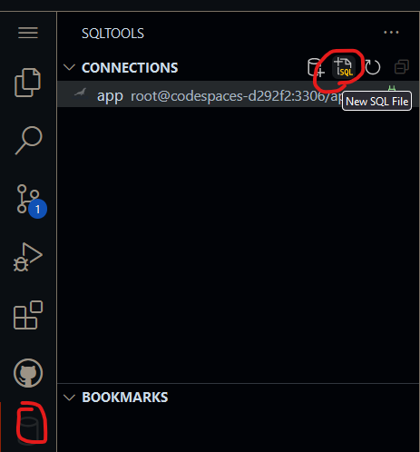

# Connecting to a Database in CodeSpaces

**Step 1: Wait for the environment to initialize**

When you create the codespace, wait for the init.sh script to run. Do not close the terminal window. The script will install the necessary software and extensions.

After the script completes, you can open the terminal and run the following command to verify that the MySQL server is running:

```bash
mysql --version
```

**Step 2: Run query to get hostname**

Run the following command to get the hostname of the MySQL server:

```bash
sudo mysql -u root -e "SHOW variables WHERE variable_name = 'hostname'"
```



**Step 3: Create the connection configuration in SQLTools**

On the left hand side of VS Code,



Click "Add New Connection".

Select "MariaDB" as the database type.

Fill in the connection details, replacing the hostname with the value you got from the previous step:



Save the connection.

**Step 4: Connect to the database**

Click the "Connect" button to connect to the database.



Allow access when prompted.

When prompted for the password, enter "admin".

**Step 5: Run a query**

By default it will open a query tab when you connect. You can close this when you don't need it.

To browse the database and run a query, click the "SQLTools" icon on the left hand side of VS Code and select the "New SQL File" button.


