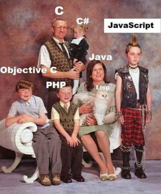

- [What is JavaScript?](#what-is-javascript)
- [Where do I Write JavaScript?](#where-do-i-write-javascript)
- [The Console and Debugging](#the-console-and-debugging)
  - [Developer Tools and the Console](#developer-tools-and-the-console)
    - [console.log()](#consolelog)
- [Syntax and Basic Concepts](#syntax-and-basic-concepts)
  - [Comments](#comments)
  - [Semicolons](#semicolons)
  - [Curly Braces](#curly-braces)
  - [Variables and Constants](#variables-and-constants)
    - [Data Types](#data-types)
    - [Declaration and Scope](#declaration-and-scope)
  - [Strings](#strings)
  - [Arrays](#arrays)
  - [If Statements](#if-statements)
  - [Loops](#loops)
  - [Functions](#functions)

<figure>
    <span>
        
    </span>
    <figcaption>
        <a href=""></a>
    </figcaption>
</figure>

# What is JavaScript?

JavaScript is a programming language that runs in the browser.

JavaScript is a **client-side** programming language.

# Where do I Write JavaScript?

Most commonly, JavaScript is written in a separate file and linked the HTML file.

```html
<script src="myScript.js"></script>
```

JavaScript can also be written directly in the HTML file.

```html
<script>
  // JavaScript goes here
</script>
```

For quick demos and testing, JavaScript can be written directly in the browser's console.

# The Console and Debugging

<figure>
    <span>
        
    </span>
    <figcaption>
        <a href=""></a>
    </figcaption>
</figure>

## Developer Tools and the Console

**Developer tools** in browser, hit `F12`.

For playground and exploration:

- Go to "Console"
- Switch to multiline editor mode (book-looking icon)
- You will need to refresh the page to reset any existing variables.

To debug existing code:

- Go to "Debugger"
- Set breakpoints and step through as needed.

### console.log()

Use `console.log()` to print values to the console.

```javascript
const myVariable = "Hello, world!";
console.log(myVariable);
```

# Syntax and Basic Concepts

## Comments

Code that is put in comments will not be executed.

Useful both for documentation and debugging, "commenting out code".

```javascript
/*
This is a multi-line comment.
So many lines!
Whoa!
*/

// This is a single-line comment.
```

## Semicolons

<figure>
    <span>
        
    </span>
    <figcaption>
        <a href=""></a>
    </figcaption>
</figure>

Javascript is a semicolon-terminated language. They are required after every statement.

```javascript
let x = 5;
let y = 6;
let z = x + y;
```

But... if you don't use them JS will try to add them for you when the code runs.

This is called **automatic semicolon insertion (ASI)**.

**_Prof note:_** my code editor (VS Code) will not let me omit semicolons in the notes, so we'll demo this without semicolons in class.

**Takeaway**: Always use semicolons. Don't rely on ASI.

## Curly Braces

JavaScript uses curly braces to denote blocks of code.

(Unlike Python, which uses indentation.)

```javascript
// This is an arbitrary block of code just to prove the point.
// We're normally talking about if statements, loops, functions, etc.
{
  let x = 5;
}
print(x); // Error: x is not defined
```

## Variables and Constants

### Data Types

JavaScript is a dynamically typed language.

- Don't declare variable types.
- Variables can be reassigned to different data types.

```javascript
let x = 5;
x = "Hello, world!";
```

Some common data types:

- `string`
- `number`
- `boolean`
- `undefined`
- `object`

### Declaration and Scope

In modern JS, variables are declared with `let` or `const`.

- `const` is used for values that will not change.
- `let` is used for values that will change.

```javascript
const PI = 3.14;
let r = 5;
let area = PI * r * r;
```

In older JS you may see `var` used instead of `let`. `var` is function-scoped, while `let` is block-scoped.

```javascript
var x = 5;
if (true) {
  var x = 10;
}
console.log(x); // 10
```

```javascript
let x = 5;
if (true) {
  let x = 10;
}
console.log(x); // 5
```

**Takeaway:** Use `const` for values that will not change, and `let` for values that will change.

## Strings

... TODO: concat, interpolation, formatting ...

## Arrays

... TODO ...

## If Statements

... TODO ...

## Loops

... TODO ...

## Functions

... TODO ...
