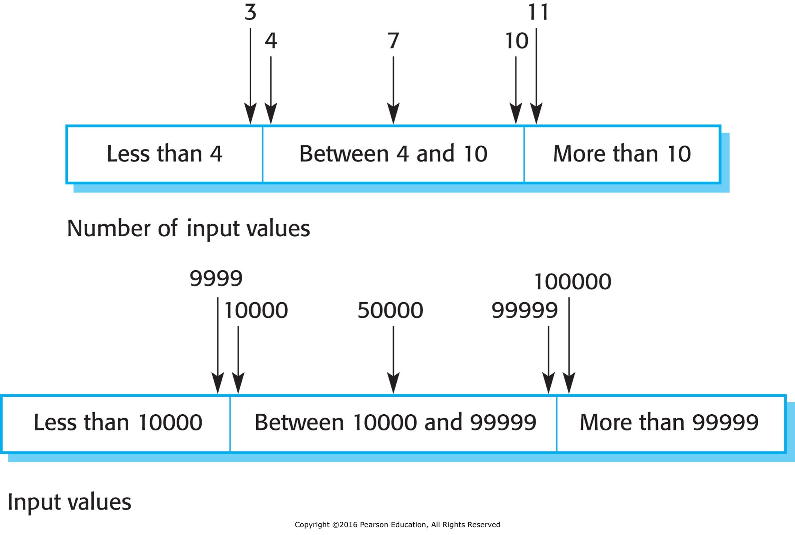

- [Software Testing](#software-testing)
  - [Validation Testing](#validation-testing)
  - [Defect Testing](#defect-testing)
  - [Stages of Testing](#stages-of-testing)
    - [Development Testing](#development-testing)
      - [Unit Testing](#unit-testing)
        - [Parts of a Unit Test](#parts-of-a-unit-test)
        - [Configuring Initial State](#configuring-initial-state)
        - [Choosing Test Cases](#choosing-test-cases)
          - [Partition Testing](#partition-testing)
    - [Release Testing](#release-testing)
    - [User Testing](#user-testing)

# Software Testing

<!-- Objective when testing:

1. Demonstrate software meets requirements.
1. Find inputs that cause software to break or fail to meet requirements. -->

Part of V&V (Verification and Validation) process.

> **Validation:** Are we building the right product?  
> **Verification:** Are we building the product right?  
> (Boehm, 1979)

## Validation Testing

Demonstrate software meets requirements. Check against functional and non-functional requirements.

## Defect Testing

Find inputs that cause software to break.

<figure>
    
        
    
</figure>

## Stages of Testing

Validation and defect testing can both be applied to the stages of software testing listed below.

### Development Testing

- Done as the program is built.
- Usually done by individual programmer, or paired with product support team member.
- Testing methodologies vary in degree of formality:
  - **Ad hoc testing:** No formal test plan.
  - **Test driven development (TDD):** Write tests before writing code.
  - Anywhere in between.

#### Unit Testing

- Tests individual components of the software (e.g. functions, classes).
- Automated tests run when code is compiled.

##### Parts of a Unit Test

1. Setup
   - Define inputs
   - Define expected outputs (results)
   - Initialize state
2. Execution
   - Run the code
3. Verification
   - Assert that actual outputs match expected outputs

Valid input -> Expected result (e.g. return value)

Invalid input -> Expected result (e.g. error message)

##### Configuring Initial State

Sometimes hard to simulate a real test case:

- Data (e.g. what will really be in the database)
- System load
- Network latency
- External components
- Incomplete components

**Mocking:** Replace real objects with "mock" objects.

- Subset of data to simulate real data
- Simulate network latency or delays
- Simulate responses from external components
- etc.

##### Choosing Test Cases

**Normal path:** Test cases that should work.

**Edge cases:** Test cases that are at the limits of what the software can handle.

###### Partition Testing

**Partitions:** groups of inputs that should behave the same way.

- Numeric: positive, negative, zero
- String: empty, one character, many characters
- Data set: empty, one record, many records
- Categorical: one from each category (admin vs non-admin, etc.)

<figure>
    
        
    
</figure>

Divide input space into partitions and test one input from each partition. Include both valid and invalid inputs.

Edge cases are often at the boundaries of partitions.

<!-- TODO: 
Case Study:
 Forecasting Service Decouple -->

<!-- TODO: graphic, identify partitions in old vs new model, drastically simplify -->

<!-- TODO: Unit test example -->

### Release Testing

- Done when a version of the software is ready for release, prior to turning over to users.
- Done by dedicated test team.
- Well defined and formal protocols.

### User Testing

- Done after release testing.
- Done by dedicated pool of users.
  - Client project managers
  - "Power users"
  - Opt-in beta end users

..............................................................

Review:

[Types of Testing Review](https://github.com/mpjovanovich/ivy_tech/blob/main/SDEV265_System_Software_Analysis_Project/types_of_testing_exercise.drawio)

<!--

how to test the "one test per requirement" rule with case studies

compile time vs runtime vs logic errors

logical branches

static vs dynamic testing and analysis

cost of silent fail

Unit testing - See notes
- Test harnesses

Difficult to trace errors - parallel processing, distributed systems, etc.

Case study - rewrite forecast engine

-->
