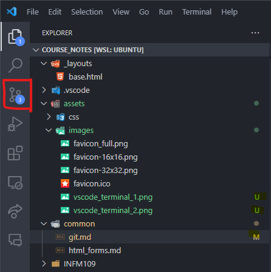

- [Git](#git)
  - [Links](#links)
  - [What is Git?](#what-is-git)
  - [How to Interface with Git](#how-to-interface-with-git)
    - [Command Line Interface (CLI)](#command-line-interface-cli)
      - [The `git` Command](#the-git-command)
      - [Terminals and Shells](#terminals-and-shells)
    - [Graphical User Interface (GUI)](#graphical-user-interface-gui)
  - [GitHub](#github)
  - [VS Code](#vs-code)
    - [VS Code Terminal](#vs-code-terminal)
    - [VS Code Source Control Panel](#vs-code-source-control-panel)

<!-- # Version Control and Collaboration Tools

Several tools we may use, each with own purpose:

- [Git](https://git-scm.com/)
- [GitHub](https://github.com/)
- [GitHub CodeSpaces](https://docs.github.com/en/codespaces/overview)
- [VS Code](https://code.visualstudio.com/) -->

# Git

## Links

- [Git (main site)](https://git-scm.com/)
- [Git for Windows](https://gitforwindows.org/)

## What is Git?

**Git** is a program that runs on a computer.

Git is a **version control system (VCS)**:

- Stores files and their history
- Tracks changes to files over time
- Allow for point in time recovery and comparison
- Allows more than one person to work on (or examine) the same file at the same time.

## How to Interface with Git

### Command Line Interface (CLI)

- Recommended for intermediate / advanced users
- Type commands starting with `git` into a terminal
- Often preinstalled on Linux and macOS
- See Windows link above for Windows

#### The `git` Command

All git commands are `git [your_command_here] --[optional_flags_here]`.

#### Terminals and Shells

Git commands are typed into a **terminal** which runs a **shell**.

- A **terminal** provides a user interface into a shell.

  - This is what you type commands into.
  - Like the part of the car that you see and interact with.

- A **shell** is a program that executes text **commands**.

  - This is what actually runs the command.
  - Like the "engine" of a car.
  - Usually use `bash` or `zsh` shells.

### Graphical User Interface (GUI)

- Recommended for beginners
- GitHub via the browser
- VS Code Source Control Panel

## GitHub

## VS Code

#### VS Code Terminal

The CLI for Git can be accessed in a VS Code terminal:

- `Ctrl + ~` or `View > Terminal`.

Make sure that you are in the root directory of your project:

- Use the `pwd` command to see the current directory.

Make sure that you have the correct shell selected, _bash_ or _zsh_:

#### VS Code Source Control Panel

The GUI for Git can be accessed in the VS Code Source Control Panel:

- The number in the circle indicates the number of files that have been changed.
-
